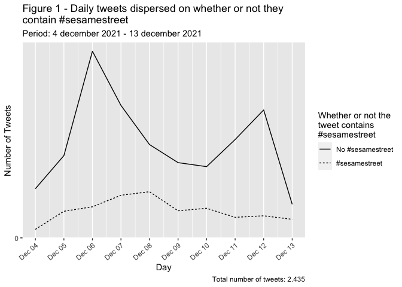

# Programming Historian English Language Lesson Template

This file can be used as a template for writing your lesson. It includes information and guidelines on formatting which supplement but do not replace the author's guidelines (/en/author-guidelines)

## Some Important Reminders:

*	Tutorials should not exceed 8,000 words (including code).
*	Keep your tone formal but accessible.
*	Talk to your reader in the second person (you).
*	Adopt a widely-used version of English (British, Canadian, Indian, South African etc).
*	The piece of writing is a "tutorial" or a "lesson" and not an "article".
*  Adopt open source principles
*  Write for a global audience
*  Write sustainably

# Lesson Metadata

**Delete everything above this line when ready to submit your lesson**.

title: Scalable Reading of Structured Data
collection: lessons
layout: lesson
slug: LEAVE BLANK
date: LEAVE BLANK
translation_date: LEAVE BLANK
authors:
- Max Odsbjerg Pedersen 1
- Josephine Møller Jensen 2
- Victor Harbo Johnston 3
- Alexander Ulrich Thygelsen 4
- Helle Strandgaard Jensen 5
reviewers:
- LEAVE BLANK
editors:
- LEAVE BLANK
translator:
translation-editor:
- LEAVE BLANK
translation-reviewer:
- LEAVE BLANK
original: LEAVE BLANK
review-ticket: LEAVE BLANK
difficulty: LEAVE BLANK
activity: LEAVE BLANK
topics: LEAVE BLANK
abstract: LEAVE BLANK
---

# Table of Contents



--
# Lesson Structure
In this lesson, we introduce a workflow for scalable reading of structured data. The lesson is structured in two parallel tracks: 
1. A general track suggesting a way to work analytically with structured where distant reading of a large dataset is used as context for a close reading of  distinctive datapoints. 
2. An example track which uses we use simple functions in the programming language R to analyze Twitter data. 
Combining these two tracks we show how scalable reading can be used to analyze a wide variety of structured data. Our suggested scalable reading workflow includes two types of distant readings that will help explore and analyze overall features in large data sets (timely dimensions and binary relationships), plus a way of using distant reading to select individual data points for close reading in a systematic and reproducible manner.
# Lesson Aims
* Setting up a workflow where exploratory, distant reading is used as a context that guides the selection of individual data points for close reading 
* Employ exploratory analyses to find patterns in structured data
* Apply and chain basic filtering and arranging functions in R (if you have no or little knowledge of R, we recommend looking at this lesson before you begin)

# Gateway for newcomers: bridging traditional and computational methods 
The combination of close and distant reading we suggest in this lesson is meant as a way for students and academics who are new to the kind of computational thinking embedded in digital methods. When connecting distant reading of large datasets to close reading of single data points, we bridge between digital and traditional methods. In our experience, the scalable reading where the analysis of the entire data sets represents a set of contexts for the close reading eases the difficulties newcomers might experience in asking questions of their material which can be solved using computational thinking. The reproducible way of selecting individual cases for closer inspection speaks, for instance, directly to central questions within the discipline of history and sociology regarding the representativity of case studies. 

# The Scalable Reading 
We originally used the workflow presented below to analyze the remembrance of the American children’s television program *Sesame Street* on Twitter. We used the combined close and distant reading to find out which events generated discussion of *Sesame Street’s* history, which twitter-users dominated the discourse about *Sesame Street’s* history, and which parts of the show's history they mentioned. However, the same analytical framework can also be used to analyze many other kinds of structured data. To demonstrate the applicability of the workflow to other kinds of data, we discuss how it could be applied to a set of structured data from the digitized collections from the National Gallery of Denmark. The data from the National Gallery is very different from the Twitter data used in the lesson's example track, but the general idea of using distant reading to contextualize close reading works equally well as with the Twitter data. 

The workflow for scalable reading of structured data has three steps: 
1. **Exploration of a dataset’s timely dimension.**  This step suggests a chronological exploration of a dataset. In the Twitter dataset, we explore how a specific phenomenon gains traction on the platform during a certain period of time. Had we worked on data from the National Gallery we could have analyzed the timely distribution of their collections e.g. accoring to acquisition year or when artworks were made.
 
2. **Exploration of binary relations in a dataset**  This step suggests using a binary structure in the dataset as a way to analyze some overall trends. In the Twitter dataset, we explore the use of hash-tags (versus lack of use); the distribution of tweets on verified versus non-verified accounts; and the interaction level of these two account types. Had we worked on data from the National Gallery, it could be a representation of male versus female artists; Danish versus international artists; or paintings versus non-paintings. 

3. **Systematic selection of single datapoints for close reading**  This step suggests a systematic and reproducible way of selecting single datapoints for close reading. In the Twitter dataset, we systematically selected the top 20 liked, retweeted and commented tweets for close reading. Had we worked on data from the National Gallery, it could for instance, be the top 20 most exhibited, borrowed, or annotated items.  

Below, the three steps are explained in general terms as well as specifically using our Twitter example. 

# Data
If you want to reproduce the analysis we present below, using not only the overall conceptual framework but also the code, we assume that you already have a dataset containing twitter data in a JSON format. Acquisition could, for instance, have happened: 

1. Using Twitter’s APIs: Open/Essential, Academic/Premium (see more about APIs this section to the [Introduction to Populating a Website with API Data](https://programminghistorian.org/en/lessons/introduction-to-populating-a-website-with-api-data#what-is-application-programming-interface-api))
2. Using this lesson from the Programming Historian (however, you need to choose a JSON rather than a CSV output).

In the project for which the workflow was originally developed, we had c. 200,000 tweets collected with the Premium API over two periods of 31 days each. However, for the purpose of this lesson, we made a new dataset using the Open API to make the test case as close to a classroom setting as possible.
#Exploration of a dataset’s timely dimension
The R code described below is written with the specific purpose of analyzing twitter data, but the three steps can hopefully be of inspiration to students and researchers in the social sciences and humanities who want to use distant reading to qualify and contextualize results in relation to their close readings. 

# Timedispersion analysis with twitterdata

    library(rtweet)
    library(tidyverse)

    ## ── Attaching packages ─────────────────────────────────────── tidyverse 1.3.0 ──

    ## ✓ ggplot2 3.3.3     ✓ purrr   0.3.4
    ## ✓ tibble  3.0.5     ✓ dplyr   1.0.3
    ## ✓ tidyr   1.1.2     ✓ stringr 1.4.0
    ## ✓ readr   1.4.0     ✓ forcats 0.5.0

    ## ── Conflicts ────────────────────────────────────────── tidyverse_conflicts() ──
    ## x dplyr::filter()  masks stats::filter()
    ## x purrr::flatten() masks rtweet::flatten()
    ## x dplyr::lag()     masks stats::lag()

    library(lubridate)

    ## 
    ## Attaching package: 'lubridate'

    ## The following objects are masked from 'package:base':
    ## 
    ##     date, intersect, setdiff, union

# Acuirreing your data

In the following example, you will learn how to process and visualize
data acquired from Twitter.com using the Essential access Twitter API.
In this example, you will create your dataframe by making a free-text
search on the term “sesamestreet” using the `search_tweets()`-function
from the “rtweet”-package.

    sesamestreet_data <- search_tweets(q = "sesamestreet", n = 18000)

# Timely dispersion of hashtags and fretext

In the following we start of with some data processing before moving on
to the actual visualisation. The question we are asking the data here is
a two-piece one.

-   First of we want to know the dispersion of the tweets over time.
-   Second we want to know how many of these contain a the hashtag
    “\#sesamestreet”.

Especially the last question needs some data wranglig before it is
possible to answer it. The process here is to create a new column which
has the value “TRUE” if the tweet contains the hashtag and FALSE if not.
This is done with the `mutate()`-function, which creates a new column
called “has\_sesame\_ht”. To put the TRUE/FALSE-values in this column we
use the `str_detect()`-function. This function is told that it is
detecting on the column “text”, which contains the tweet. Next it is
told what it is detecting. Here we use the `regex()`-function within
`str_detect()` and by doing that we can specify that we are interested
in all variants of the hashtag (eg \#SesameStreet, \#Sesamestreet,
\#sesamestreet, \#SESAMESTREET, etc.). This is achieved by setting
“ignore\_case = TRUE”.

The next step is another `mutate()`-function, where we create a new
column “date”. This column will contain just the date of the tweets
instead of the entire timestamp from Twitter that not only contains the
date, but also the hour, minute and second of the Tweet. This is
obtained with the `date()`-function from the “lubridate”-packages, which
is told that it should extract the date from the “created\_at”-column.  
Lastly we use the `count`-function from the “tidyverse”-package to count
TRUE/FALSE-values in the “has\_same\_ht”-column per day in the data set.

    sesamestreet_data %>% 
      mutate(has_sesame_ht = str_detect(text, regex("#sesamestreet", ignore_case = TRUE))) %>% 
      mutate(date = date(created_at)) %>% 
      count(date, has_sesame_ht)

    ## # A tibble: 20 x 3
    ##    date       has_sesame_ht     n
    ##    <date>     <lgl>         <int>
    ##  1 2021-12-04 FALSE            99
    ##  2 2021-12-04 TRUE             17
    ##  3 2021-12-05 FALSE           165
    ##  4 2021-12-05 TRUE             53
    ##  5 2021-12-06 FALSE           373
    ##  6 2021-12-06 TRUE             62
    ##  7 2021-12-07 FALSE           265
    ##  8 2021-12-07 TRUE             86
    ##  9 2021-12-08 FALSE           187
    ## 10 2021-12-08 TRUE             93
    ## 11 2021-12-09 FALSE           150
    ## 12 2021-12-09 TRUE             55
    ## 13 2021-12-10 FALSE           142
    ## 14 2021-12-10 TRUE             59
    ## 15 2021-12-11 FALSE           196
    ## 16 2021-12-11 TRUE             41
    ## 17 2021-12-12 FALSE           255
    ## 18 2021-12-12 TRUE             44
    ## 19 2021-12-13 FALSE            55
    ## 20 2021-12-13 TRUE             35

This is the result we now want to visualise. In the code below we have
appended the code for the visualisation to the four lines of code above
that transforms the data to our needs.  
To pick up where we left in the previous code chunk we continue with the
`ggplot()`-function, which is the graphics package of the “tidyverse”.
This function is told that it should put date on the x-axis and the
counted number of TRUE/FALSE-values on the y-axis. The next line of the
creation of the visualisation is `geom_line()`,where we specify
linetype=has\_sesame\_ht, thus creating creating two lines for; one for
TRUE and one for FALSE.

The lines of code following the `geom_line()` argument tweaks the
aesthetics of the visualisation. `scale_linetype()`tells R, what the
lines should be labeled as. `scale_x_date()` and `scale_y_continuous()`
changes the looks of the x- and y-axis respectively. At last, the
`labs()` and `guides()` arguments are used to create descriptive text on
the visualisation.

Remember to inspect your data in your R environment and adjust these
labels to fit your acquired data.

    sesamestreet_data%>% 
      mutate(has_sesame_ht = str_detect(text, regex("#sesamestreet", ignore_case = TRUE))) %>% 
      mutate(date = date(created_at)) %>% 
      count(date, has_sesame_ht) %>% 
      ggplot(aes(date, n)) +
      geom_line(aes(linetype=has_sesame_ht)) +
      scale_linetype(labels = c("No #sesamestreet", "#sesamestreet")) +
      scale_x_date(date_breaks = "1 day", date_labels = "%b %d") +
      scale_y_continuous(breaks = seq(0, 30000, by = 5000)) +
      theme(axis.text.x=element_text(angle=40, hjust=1)) +
      labs(title = "Figure 1 - Daily tweets dispersed on whether or not they\ncontain #sesamestreet", y="Number of Tweets", x="Day", subtitle = "Period: 4 december 2021 - 13 december 2021", caption = "Total number of tweets: 2.413") +
      guides(linetype = guide_legend(title = "Whether or not the\ntweet contains \n#sesamestreet"))

You should now have a graph dipicting the timely dispersion of tweets in
your dataset.
