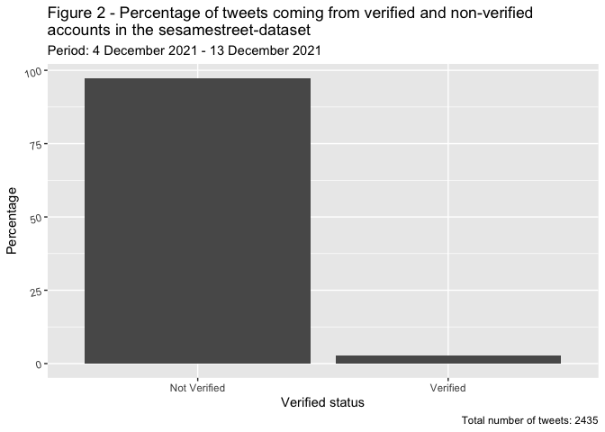
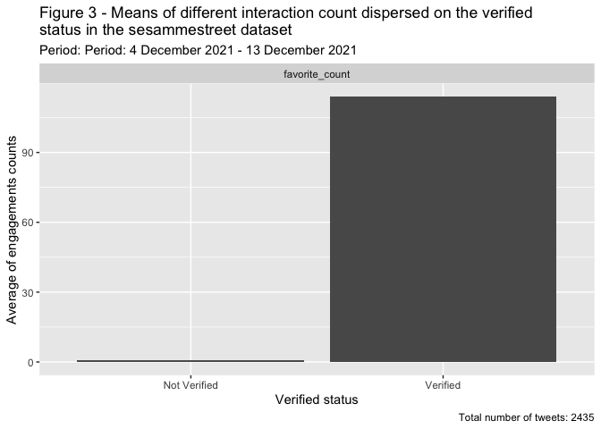

    library(tidyverse)
    library(jsonlite)
    library(lubridate)
    library(rtweet)

# Loading dataset

The dataset collected from the
Twitter-API\[<https://developer.twitter.com/en/docs/twitter-api/getting-started/getting-access-to-the-twitter-api>\]
is stored in the json-format. You thus loaded into R with the function
`fromJSON` from the jsonlite-package. You name the dataset
“sesamestreet\_data” and you will be using this name, when referring to
the dataset in R.

    sesamestreet_data <- search_tweets("sesamestreet", n = 18000, include_rts = TRUE)

# Who remembers

## How many of the tweets from our data are created by verified accounts

In this first example of data processing you will take each step of it
to show the logic of the pipe (`%>%`) in R. Once you get a hold of this
idea the remainder of the data processing will be more easy to read and
understand. The overall goal of this section is to find out how the
tweets disperses on non-verified and verified account and visualize the
result .

Using the pipe `%>%` you pass the data on downwards - the data is
flowing through the pipe like water! Here you pour the data to the
`count`-function and ask it to count on the column “verified” that holds
two values. Either it has “TRUE” - then the account is verfied - or it
has “FALSE” - then it isn’t.

    sesamestreet_data %>% 
      count(verified)

    ## # A tibble: 2 x 2
    ##   verified     n
    ## * <lgl>    <int>
    ## 1 FALSE     2374
    ## 2 TRUE        64

So now you have the count - but it would make more sence to have these
figures in percentage. Therefore our next step will be adding another
pipe and a pieces of code creating a new column holding the number of
total tweets in our dataset - this is necessary for calculating the
percentage later. You get the total number of tweets by using the
`nrow`-function that returns the number of rows from a dataframe. In our
dataset one row = one tweet:

    sesamestreet_data %>% 
      count(verified) %>% 
      mutate(total = nrow(sesamestreet_data))

    ## # A tibble: 2 x 3
    ##   verified     n total
    ## * <lgl>    <int> <int>
    ## 1 FALSE     2374  2438
    ## 2 TRUE        64  2438

Using another pipe you now create a new column called “percentage” where
you calculate and store the percentage of the dispersion between
verified and non-verified tweets:

    sesamestreet_data %>% 
      count(verified) %>% 
      mutate(total = nrow(sesamestreet_data)) %>% 
      mutate(pct = (n / total) * 100)

    ## # A tibble: 2 x 4
    ##   verified     n total   pct
    ## * <lgl>    <int> <int> <dbl>
    ## 1 FALSE     2374  2438 97.4 
    ## 2 TRUE        64  2438  2.63

The next step is to visualize this result. Here you use the
“ggplot2”-package to create a bar chart:

The difference from the earlier visualisations showing tweets over time
is here the type of plot used, this is specified with the `geom_col()`
argument.

    sesamestreet_data %>% 
      count(verified) %>% 
      mutate(total = nrow(sesamestreet_data)) %>% 
      mutate(pct = (n / total) * 100) %>% 
      ggplot(aes(x = verified, y = pct)) +
      geom_col() +
      scale_x_discrete(labels=c("FALSE" = "Not Verified", "TRUE" = "Verified"))+
          labs(x = "Verified status",
          y = "Percentage",
          title = "Figure 2 - Percentage of tweets coming from verified and non-verified\naccounts in the sesamestreet-dataset",
          subtitle = "Period: 4 December 2021 - 13 December 2021", 
          caption = "Total number of tweets: 2435") + 
      theme(axis.text.y = element_text(angle = 14, hjust = 1))

In this next code chunk we save the result for the article.

    ggsave("20211213_sesammestreet_tweets_dispersed_on_verified_status.png", width = 8, height = 5, dpi = 800)

# Means of different interaction count dispersed on the verified status in the sesammestreet dataset

In the code below you group the dataset based on each tweets verified
status. After using the grouping function all operations afterwards will
be done groupwise. In other words all the tweets coming from non
verified-accounts and all the tweets coming from verified accounts will
be treated as groups. The next step is to use the summarise-function to
calculate the mean (gns) of favorite\_count for within tweets from
non-verified and verified accounts.

    sesamestreet_data %>% 
      group_by(verified) %>% 
      summarise(gns = mean(favorite_count))

    ## # A tibble: 2 x 2
    ##   verified     gns
    ## * <lgl>      <dbl>
    ## 1 FALSE      0.892
    ## 2 TRUE     114.

In this next step you add the result from above to a dataframe and with
a new column “interaction” where you specify that it is
“favorite\_count”

    interactions <- sesamestreet_data %>% 
      group_by(verified) %>% 
      summarise(gns = mean(favorite_count)) %>% 
      mutate(interaction = "favorite_count")

This way you get a dataframe with the means of the different
interactions which makes it possible to pass it on to the ggplot-package
for visualisation, which is done below. The visualisation looks alot
like the previous bar charts, but the difference here is `facet_wrap`,
which creates three bar charts for each type of interaction:

    interactions  %>% 
      ggplot(aes(x = verified, y = gns)) +
      geom_col() +
      facet_wrap(~interaction, nrow = 1) +
      labs(title = "Figure 3 - Means of different interaction count dispersed on the verified\nstatus in the sesammestreet dataset",
           subtitle = "Period: Period: 4 December 2021 - 13 December 2021",
           caption = "Total number of tweets: 2435",
           x = "Verified status",
           y = "Average of engagements counts") +
      scale_x_discrete(labels=c("FALSE" = "Not Verified", "TRUE" = "Verified"))

